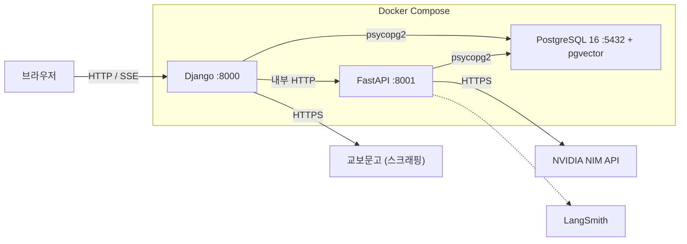
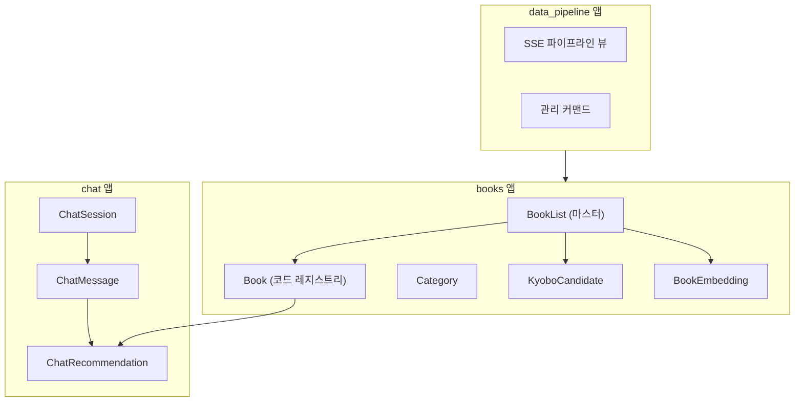
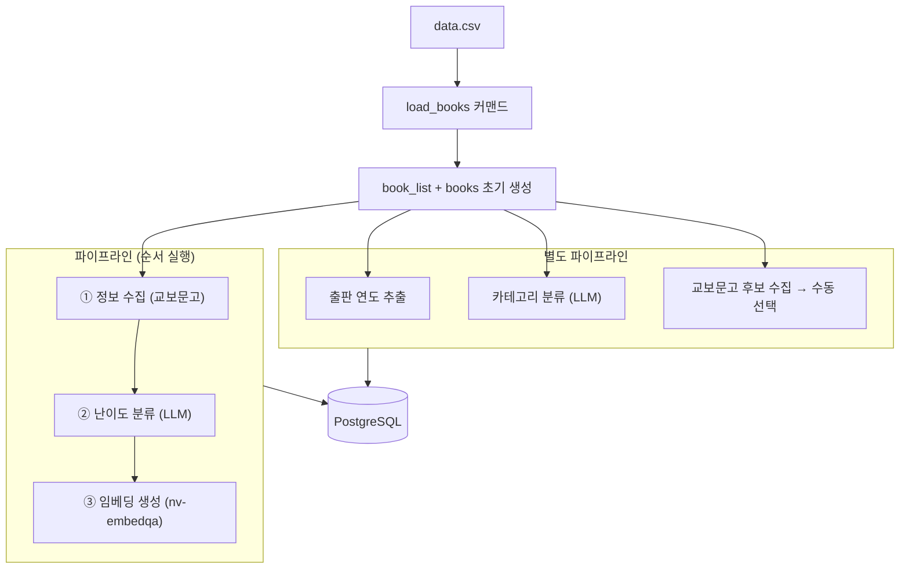
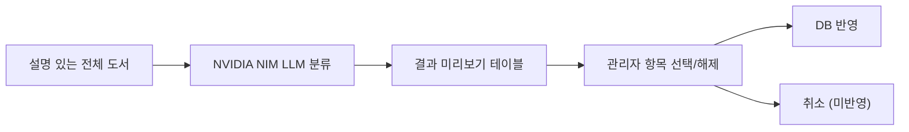
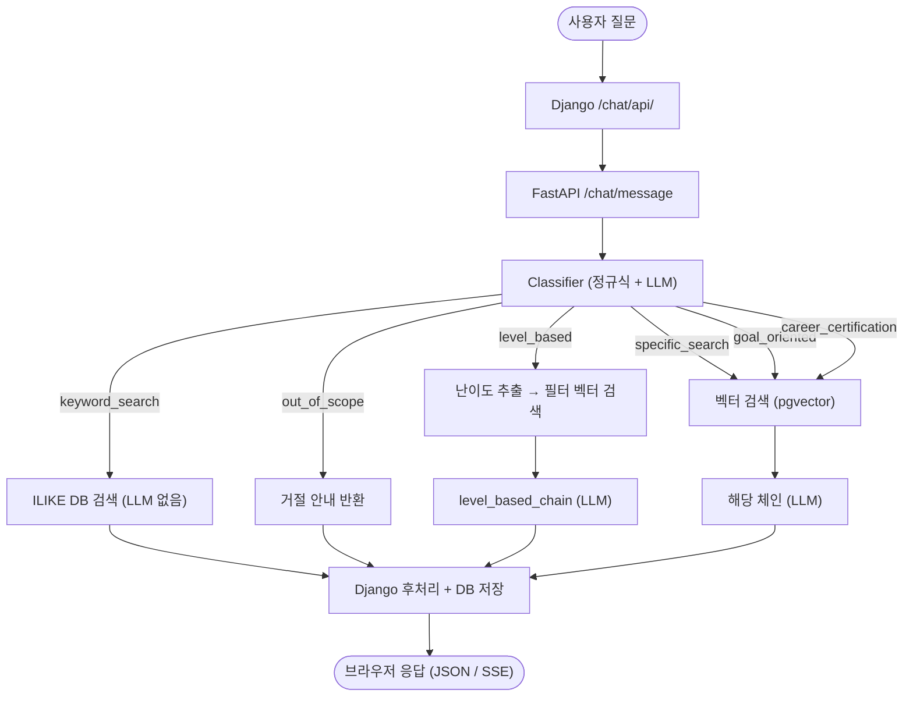
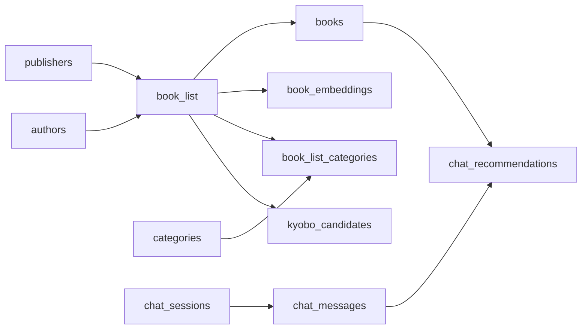
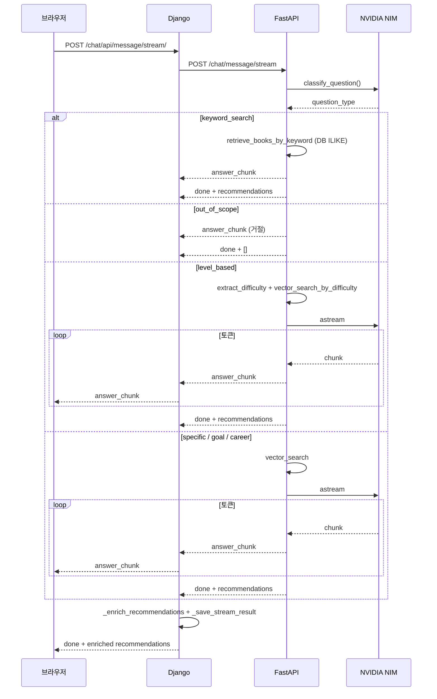

# READ:ME 시스템 아키텍처

> Mermaid 다이어그램은 GitHub · Notion · VSCode(Mermaid Preview 확장) 에서 렌더링됩니다.

---

## 1. 전체 컨테이너 구조

| 컴포넌트 | 포트 | 주요 역할 |
|---|---|---|
| **Django** | 8000 | 웹 UI, 도서 관리, 챗봇 프록시, SSE 스트림, 데이터 파이프라인 UI |
| **FastAPI** | 8001 | LLM 추론, 임베딩 생성, 질문 분류, LangChain 체인 라우팅, Rate Limiting |
| **PostgreSQL 16** | 5432 | 도서 메타데이터, pgvector 임베딩(dim=1024), 챗봇 세션·메시지 |



---

## 2. Django 앱 구조



---

## 3. 데이터 수집 파이프라인

파이프라인은 웹 UI(데이터 관리 탭) 또는 CLI 커맨드로 실행합니다.



### 정보 수집 전략

```
교보문고 검색 → 후보 선택 → 상세 페이지 스크래핑 → description · toc · thumbnail_url
```

### 난이도 분류 플로우 (v2 — 미리보기 방식)



---

## 4. 챗봇 응답 흐름



---

## 5. DB 테이블 의존 관계



---

## 6. SSE 스트리밍 시퀀스



---

## 7. Rate Limiting

| 엔드포인트 | 제한 |
|---|---|
| `POST /chat/message` | 30회 / 분 / IP |
| `POST /chat/message/stream` | 30회 / 분 / IP |

초과 시 `429 Too Many Requests`. Django 챗봇 뷰에서 429 응답을 감지하여 사용자에게 안내합니다.
