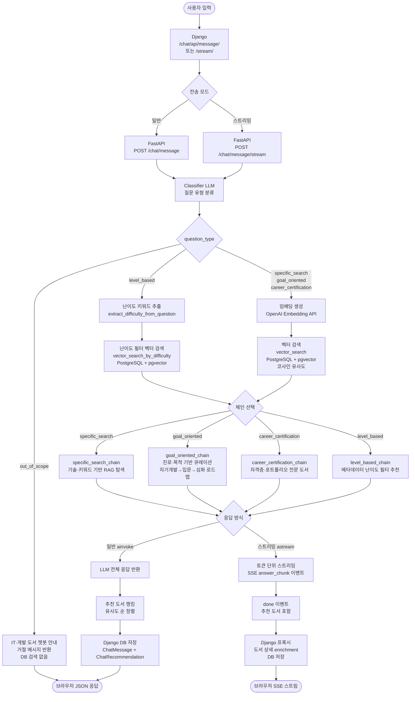
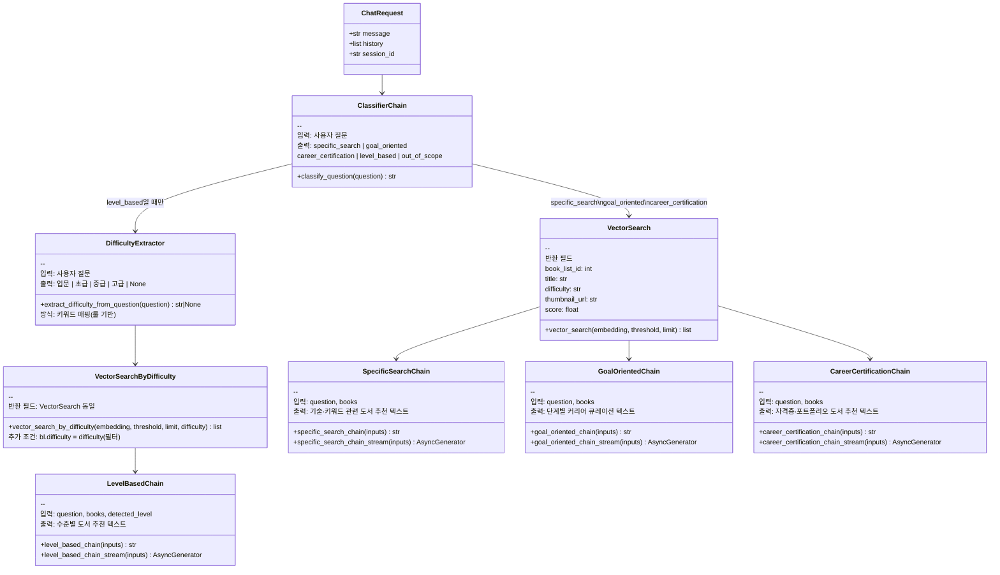
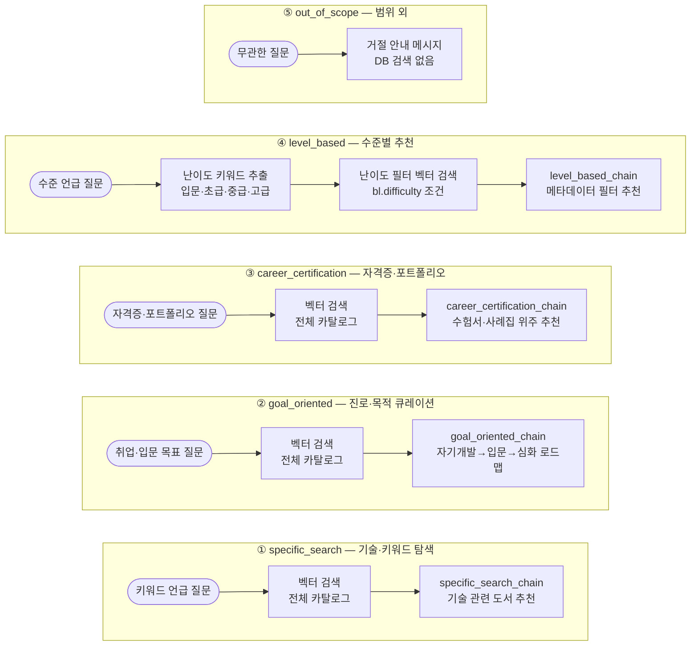
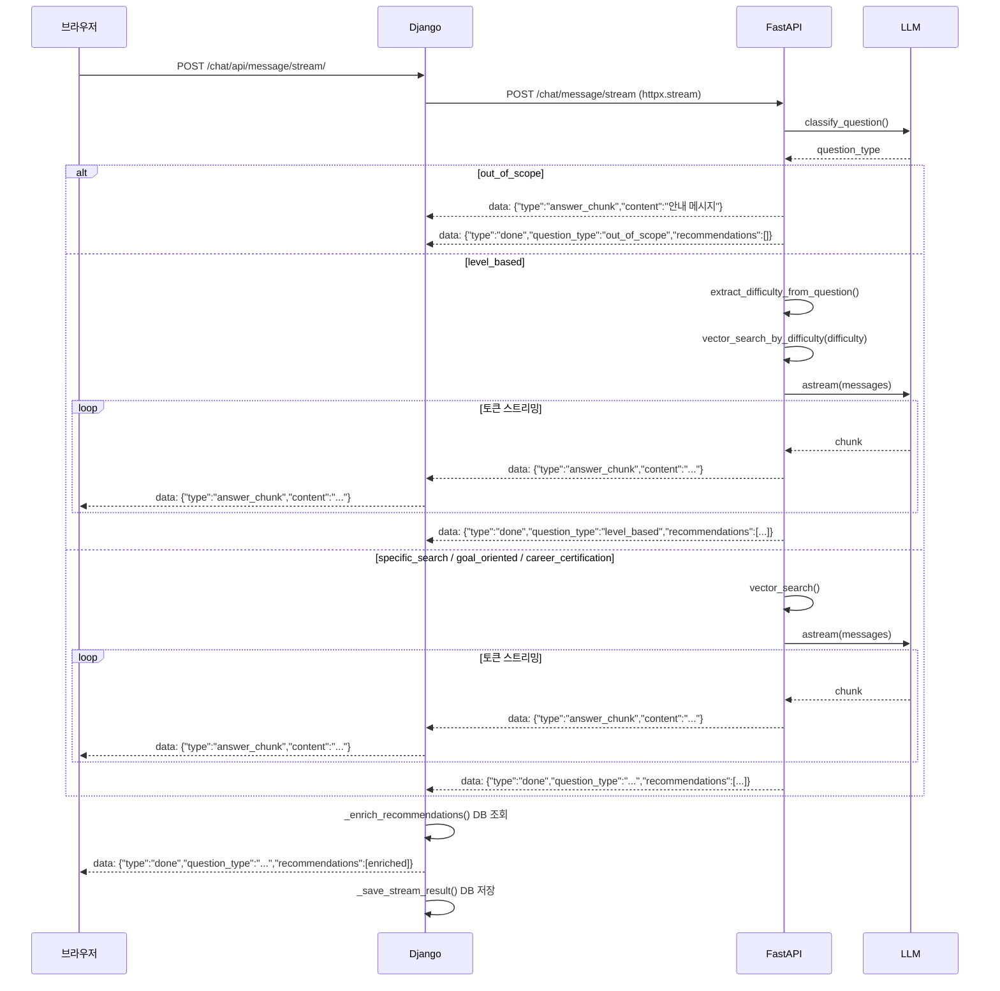

# READ:ME — LangChain 체인 분기 구조

## 전체 흐름

```mermaid
flowchart TD
    A([사용자 입력]) --> B[Django\n/chat/api/message/\n또는 /stream/]

    B --> C{전송 모드}
    C -->|일반| D[FastAPI\nPOST /chat/message]
    C -->|스트리밍| E[FastAPI\nPOST /chat/message/stream]

    D & E --> F[Classifier LLM\n질문 유형 분류]

    F --> G{question_type}

    G -->|out_of_scope| H["IT·개발 도서 챗봇 안내\n거절 메시지 반환\nDB 검색 없음"]

    G -->|level_based| I[난이도 키워드 추출\nextract_difficulty_from_question]
    I --> J[난이도 필터 벡터 검색\nvector_search_by_difficulty\nPostgreSQL + pgvector]

    G -->|specific_search\ngoal_oriented\ncareer_certification| K[임베딩 생성\nOpenAI Embedding API]
    K --> L[벡터 검색\nvector_search\nPostgreSQL + pgvector\n코사인 유사도]

    J & L --> M{체인 선택}

    M -->|specific_search| N[specific_search_chain\n기술·키워드 기반 RAG 탐색]
    M -->|goal_oriented| O[goal_oriented_chain\n진로·목적 기반 큐레이션\n자기개발→입문→심화 로드맵]
    M -->|career_certification| P[career_certification_chain\n자격증·포트폴리오 전문 도서]
    M -->|level_based| Q[level_based_chain\n메타데이터 난이도 필터 추천]

    N & O & P & Q --> R{응답 방식}

    R -->|일반 ainvoke| S[LLM 전체 응답 반환]
    R -->|스트리밍 astream| T[토큰 단위 스트리밍\nSSE answer_chunk 이벤트]

    S --> U[추천 도서 랭킹\n유사도 순 정렬]
    T --> V[done 이벤트\n추천 도서 포함]

    U --> W[Django DB 저장\nChatMessage + ChatRecommendation]
    V --> X[Django 프록시\n도서 상세 enrichment\nDB 저장]

    W & H --> Y([브라우저 JSON 응답])
    X --> Z([브라우저 SSE 스트림])
```

## 체인 입력/출력 명세

```mermaid
classDiagram
    class ChatRequest {
        +str message
        +list history
        +str session_id
    }

    class ClassifierChain {
        +classify_question(question) str
        --
        입력: 사용자 질문
        출력: specific_search | goal_oriented
              career_certification | level_based | out_of_scope
    }

    class DifficultyExtractor {
        +extract_difficulty_from_question(question) str|None
        --
        입력: 사용자 질문
        출력: 입문 | 초급 | 중급 | 고급 | None
        방식: 키워드 매핑 (룰 기반)
    }

    class VectorSearch {
        +vector_search(embedding, threshold, limit) list
        --
        반환 필드
        book_list_id: int
        title: str
        difficulty: str
        thumbnail_url: str
        score: float
    }

    class VectorSearchByDifficulty {
        +vector_search_by_difficulty(embedding, threshold, limit, difficulty) list
        --
        반환 필드: VectorSearch 동일
        추가 조건: bl.difficulty = difficulty (필터)
    }

    class SpecificSearchChain {
        +specific_search_chain(inputs) str
        +specific_search_chain_stream(inputs) AsyncGenerator
        --
        입력: question, books
        출력: 기술·키워드 관련 도서 추천 텍스트
    }

    class GoalOrientedChain {
        +goal_oriented_chain(inputs) str
        +goal_oriented_chain_stream(inputs) AsyncGenerator
        --
        입력: question, books
        출력: 단계별 커리어 큐레이션 텍스트
    }

    class CareerCertificationChain {
        +career_certification_chain(inputs) str
        +career_certification_chain_stream(inputs) AsyncGenerator
        --
        입력: question, books
        출력: 자격증·포트폴리오 도서 추천 텍스트
    }

    class LevelBasedChain {
        +level_based_chain(inputs) str
        +level_based_chain_stream(inputs) AsyncGenerator
        --
        입력: question, books, detected_level
        출력: 수준별 도서 추천 텍스트
    }

    ChatRequest --> ClassifierChain
    ClassifierChain --> DifficultyExtractor : level_based일 때만
    DifficultyExtractor --> VectorSearchByDifficulty
    ClassifierChain --> VectorSearch : specific_search\ngoal_oriented\ncareer_certification
    VectorSearch --> SpecificSearchChain
    VectorSearch --> GoalOrientedChain
    VectorSearch --> CareerCertificationChain
    VectorSearchByDifficulty --> LevelBasedChain
```

## 질문 유형별 노드·엣지 설명

```mermaid
flowchart LR
    subgraph specific_search["① specific_search — 기술·키워드 탐색"]
        direction LR
        SS1([키워드 언급 질문]) --> SS2[벡터 검색\n전체 카탈로그] --> SS3[specific_search_chain\n기술 관련 도서 추천]
    end

    subgraph goal_oriented["② goal_oriented — 진로·목적 큐레이션"]
        direction LR
        GO1([취업·입문 목표 질문]) --> GO2[벡터 검색\n전체 카탈로그] --> GO3[goal_oriented_chain\n자기개발→입문→심화 로드맵]
    end

    subgraph career_cert["③ career_certification — 자격증·포트폴리오"]
        direction LR
        CC1([자격증·포트폴리오 질문]) --> CC2[벡터 검색\n전체 카탈로그] --> CC3[career_certification_chain\n수험서·사례집 위주 추천]
    end

    subgraph level_based["④ level_based — 수준별 추천"]
        direction LR
        LB1([수준 언급 질문]) --> LB2[난이도 키워드 추출\n입문·초급·중급·고급] --> LB3[난이도 필터 벡터 검색\nbl.difficulty 조건] --> LB4[level_based_chain\n메타데이터 필터 추천]
    end

    subgraph out_of_scope["⑤ out_of_scope — 범위 외"]
        direction LR
        OS1([무관한 질문]) --> OS2["거절 안내 메시지\nDB 검색 없음"]
    end
```

## SSE 이벤트 포맷 (스트리밍 모드)

```mermaid
sequenceDiagram
    participant B as 브라우저
    participant D as Django
    participant F as FastAPI
    participant L as LLM

    B->>D: POST /chat/api/message/stream/
    D->>F: POST /chat/message/stream (httpx.stream)
    F->>L: classify_question()
    L-->>F: question_type

    alt out_of_scope
        F-->>D: data: {"type":"answer_chunk","content":"안내 메시지"}
        F-->>D: data: {"type":"done","question_type":"out_of_scope","recommendations":[]}
    else level_based
        F->>F: extract_difficulty_from_question()
        F->>F: vector_search_by_difficulty(difficulty)
        F->>L: astream(messages)
        loop 토큰 스트리밍
            L-->>F: chunk
            F-->>D: data: {"type":"answer_chunk","content":"..."}
            D-->>B: data: {"type":"answer_chunk","content":"..."}
        end
        F-->>D: data: {"type":"done","question_type":"level_based","recommendations":[...]}
    else specific_search / goal_oriented / career_certification
        F->>F: vector_search()
        F->>L: astream(messages)
        loop 토큰 스트리밍
            L-->>F: chunk
            F-->>D: data: {"type":"answer_chunk","content":"..."}
            D-->>B: data: {"type":"answer_chunk","content":"..."}
        end
        F-->>D: data: {"type":"done","question_type":"...","recommendations":[...]}
    end

    D->>D: _enrich_recommendations() DB 조회
    D-->>B: data: {"type":"done","question_type":"...","recommendations":[enriched]}
    D->>D: _save_stream_result() DB 저장
```
