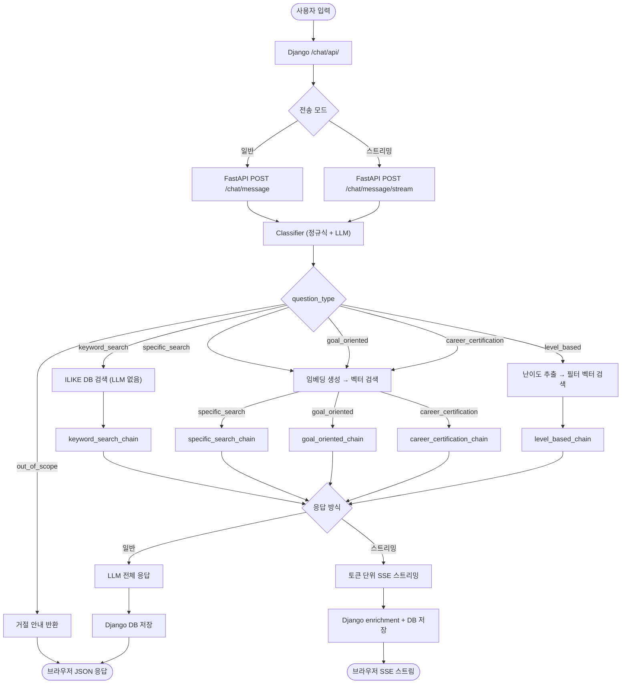
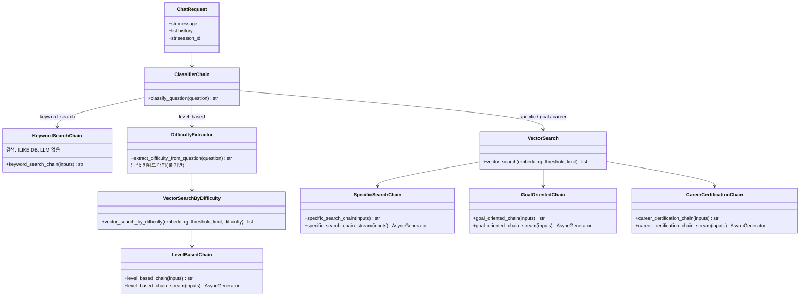
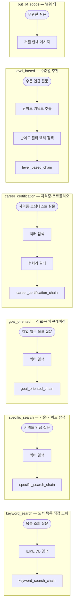
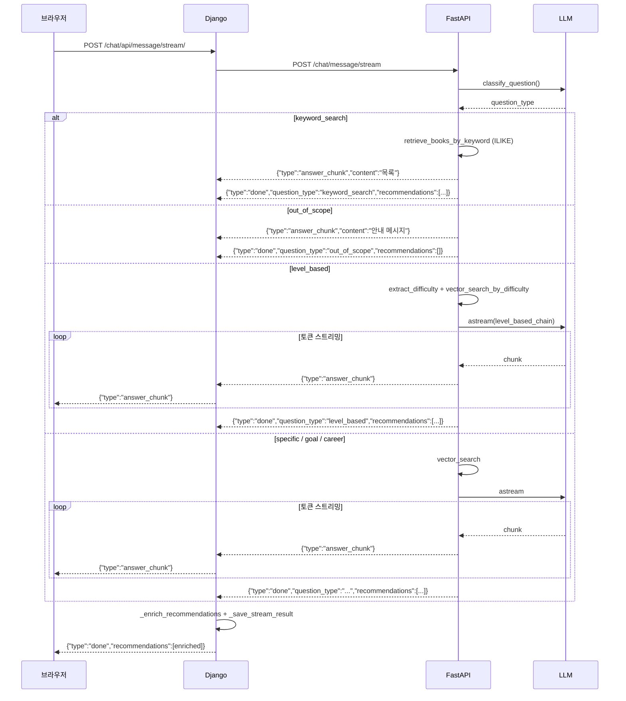

# READ:ME — LangChain 체인 분기 구조

## 전체 흐름

## 질문 유형 요약

| 유형 | 분류 방식 | 검색 방식 | LLM 호출 |
|---|---|---|---|
| `keyword_search` | 정규식 즉시 감지 | ILIKE DB 검색 | 없음 |
| `specific_search` | LLM | 벡터 유사도 | 있음 |
| `goal_oriented` | LLM | 벡터 유사도 | 있음 |
| `career_certification` | LLM | 벡터 유사도 + 후처리 필터 | 있음 |
| `level_based` | 정규식 / LLM | 난이도 필터 벡터 검색 | 있음 |
| `out_of_scope` | LLM | 없음 | 없음 |

## 체인 입력/출력 명세

## 질문 유형별 플로우

## SSE 이벤트 포맷 (스트리밍 모드)

