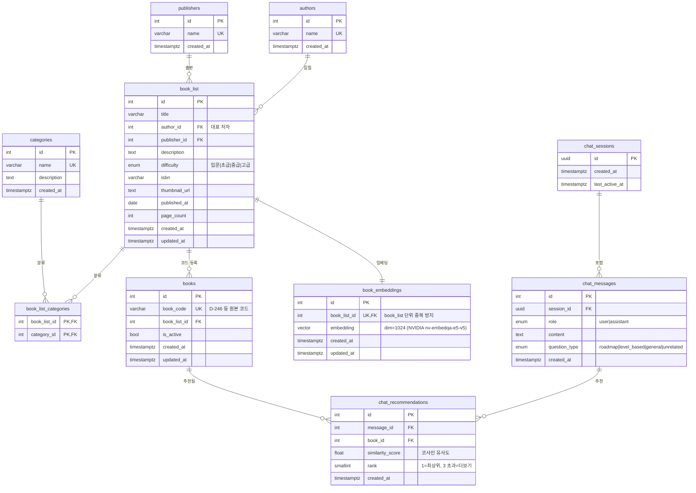

# ERD (Entity Relationship Diagram)

아래 다이어그램은 [Mermaid](https://mermaid.js.org/) 문법으로 작성되었습니다.  
GitHub, Notion, VSCode(Mermaid Preview 확장) 등에서 렌더링됩니다.



---

## 관계 요약

```
publishers (1) ──── (N) book_list
authors    (1) ──── (N) book_list    [ 대표 저자 단일 FK ]
categories (M) ──── (N) book_list   [ book_list_categories 경유 ]
book_list  (1) ──── (N) books        [ 동일 책의 다수 코드 지원, 중복 수집 방지 ]
book_list  (1) ──── (1) book_embeddings
chat_sessions (1) ── (N) chat_messages
chat_messages (1) ── (N) chat_recommendations
books       (1) ──── (N) chat_recommendations
```

---

## 데이터 흐름

```
[CSV / 관리자 입력]
        │
        ▼
   books 생성 (book_code, title, publisher_id)
        │
        ├──► Naver Book Search API ──► thumbnail_url, description, isbn, published_at
        │
        ├──► 리뷰 스크래핑 ──► LLM 난이도 분류 ──► difficulty
        │
        └──► OpenAI Embedding API ──► book_embeddings (vector)


[사용자 챗봇 질문]
        │
        ▼
   chat_sessions (신규 or 기존 UUID)
        │
        ▼
   chat_messages (role=user)
        │
        ▼
   FastAPI(LangChain) ──► 질문 분류(question_type)
        │
        ├── roadmap     ──► 단계별 로드맵 + 도서 추천
        ├── level_based ──► 수준별 도서 추천
        ├── general     ──► 도서 관련 일반 답변 + 추천
        └── unrelated   ──► "도서와 관련없는 질문입니다."
                │
                ▼
   pgvector 코사인 유사도 검색 ──► similarity_score ≥ threshold
        │
        ▼
   chat_messages (role=assistant) + chat_recommendations (rank, score)
        │
        ▼
   Django 응답 ──► LLM 텍스트 + 추천 카드 UI (rank ≤ 3 기본, 더보기)
```
