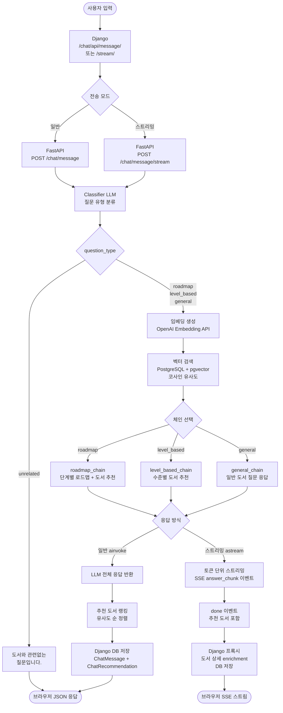
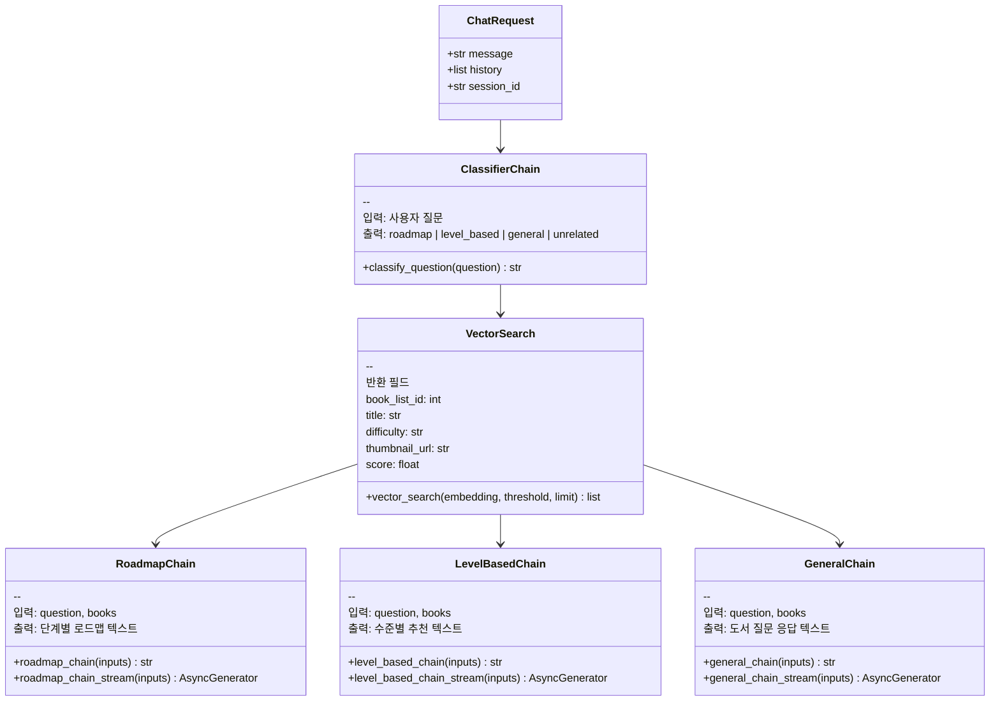
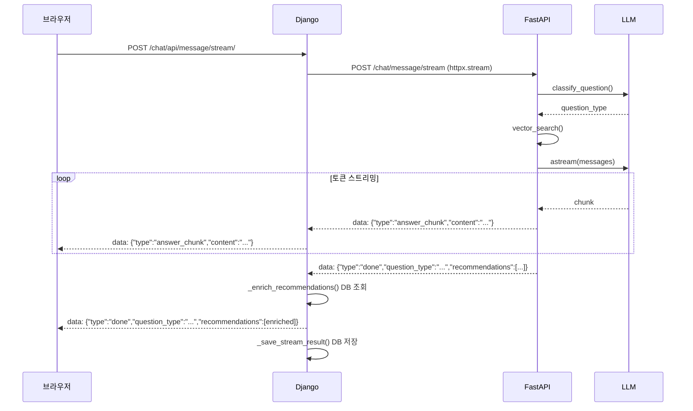

# READ:ME — LangChain 체인 분기 구조

## 전체 흐름

```mermaid
flowchart TD
    A([사용자 입력]) --> B[Django\n/chat/api/message/\n또는 /stream/]

    B --> C{전송 모드}
    C -->|일반| D[FastAPI\nPOST /chat/message]
    C -->|스트리밍| E[FastAPI\nPOST /chat/message/stream]

    D & E --> F[Classifier LLM\n질문 유형 분류]

    F --> G{question_type}

    G -->|unrelated| H["도서와 관련없는\n질문입니다."]

    G -->|roadmap\nlevel_based\ngeneral| I[임베딩 생성\nOpenAI Embedding API]
    I --> J[벡터 검색\nPostgreSQL + pgvector\n코사인 유사도]

    J --> K{체인 선택}
    K -->|roadmap| L[roadmap_chain\n단계별 로드맵 + 도서 추천]
    K -->|level_based| M[level_based_chain\n수준별 도서 추천]
    K -->|general| N[general_chain\n일반 도서 질문 응답]

    L & M & N --> O{응답 방식}

    O -->|일반 ainvoke| P[LLM 전체 응답 반환]
    O -->|스트리밍 astream| Q[토큰 단위 스트리밍\nSSE answer_chunk 이벤트]

    P --> R[추천 도서 랭킹\n유사도 순 정렬]
    Q --> S[done 이벤트\n추천 도서 포함]

    R --> T[Django DB 저장\nChatMessage + ChatRecommendation]
    S --> U[Django 프록시\n도서 상세 enrichment\nDB 저장]

    T & H --> V([브라우저 JSON 응답])
    U --> W([브라우저 SSE 스트림])
```

## 체인 입력/출력 명세

```mermaid
classDiagram
    class ChatRequest {
        +str message
        +list history
        +str session_id
    }

    class ClassifierChain {
        +classify_question(question) str
        --
        입력: 사용자 질문
        출력: roadmap | level_based | general | unrelated
    }

    class VectorSearch {
        +vector_search(embedding, threshold, limit) list
        --
        반환 필드
        book_list_id: int
        title: str
        difficulty: str
        thumbnail_url: str
        score: float
    }

    class RoadmapChain {
        +roadmap_chain(inputs) str
        +roadmap_chain_stream(inputs) AsyncGenerator
        --
        입력: question, books
        출력: 단계별 로드맵 텍스트
    }

    class LevelBasedChain {
        +level_based_chain(inputs) str
        +level_based_chain_stream(inputs) AsyncGenerator
        --
        입력: question, books
        출력: 수준별 추천 텍스트
    }

    class GeneralChain {
        +general_chain(inputs) str
        +general_chain_stream(inputs) AsyncGenerator
        --
        입력: question, books
        출력: 도서 질문 응답 텍스트
    }

    ChatRequest --> ClassifierChain
    ClassifierChain --> VectorSearch
    VectorSearch --> RoadmapChain
    VectorSearch --> LevelBasedChain
    VectorSearch --> GeneralChain
```

## SSE 이벤트 포맷 (스트리밍 모드)

```mermaid
sequenceDiagram
    participant B as 브라우저
    participant D as Django
    participant F as FastAPI
    participant L as LLM

    B->>D: POST /chat/api/message/stream/
    D->>F: POST /chat/message/stream (httpx.stream)
    F->>L: classify_question()
    L-->>F: question_type
    F->>F: vector_search()
    F->>L: astream(messages)
    loop 토큰 스트리밍
        L-->>F: chunk
        F-->>D: data: {"type":"answer_chunk","content":"..."}
        D-->>B: data: {"type":"answer_chunk","content":"..."}
    end
    F-->>D: data: {"type":"done","question_type":"...","recommendations":[...]}
    D->>D: _enrich_recommendations() DB 조회
    D-->>B: data: {"type":"done","question_type":"...","recommendations":[enriched]}
    D->>D: _save_stream_result() DB 저장
```
